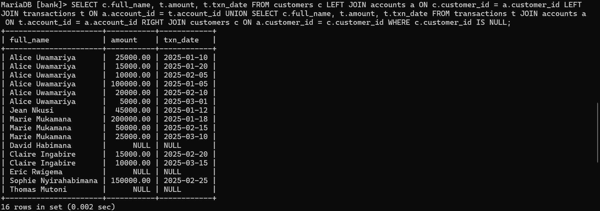

BUSINESS PROBLEM

Ten branches make up the regional commercial bank Unity Bank. Using information from transactions, the Retail Banking Department is trying to identify high-value customers, minimize customer loss, and boost branch performance.
The Retail Banking Department faces challenges in understanding customer behavior, identifying high-value clients, and detecting at-risk (inactive) customers. Currently, data is stored in separate tables for customers, accounts, and transactions, making it difficult to: Identify top depositors per branch, Track monthly deposit trends, Segment customers by activity level, Reactivate dormant accounts.

This project uses SQL JOINs and Window Functions in MySQL 8.0 (via XAMPP) to turn raw data into useful business insights that support customer retention, targeted marketing, and branch performance optimization.

DATABASE SCHEMA

  
SUCCESS CRITERIA

This analysis fulfills the following measurable objectives using MySQL window functions:

1. Top 5 depositors per branch → RANK()
   
3. Running monthly deposit total per branch → SUM() OVER() with ROWS UNBOUNDED PRECEDING
   
4. Month-over-month % change in average deposit size → LAG()
   
6. Customer quartiles by transaction count → NTILE(4)
   

JOIN SQL
1. INNER JOI
       
2. LEFT JOIN
    
3. RIGHT JOIN
    
4. FULL OUTER JOIN
   
5. SELF JOIN
   
KEY INSIGHTS

DESCRIPITIVE INSIGHTS

Branch 1001 (Kigali Main) generated RWF 300,000 in total deposits from January to March 2025.
Alice Uwamariya was the top depositor with RWF 140,000, contributing 47% of her branch’s total.
3 out of 8 customers (Thomas Mutoni) had zero transactions — classified as fully dormant.

DIAGNOSTICS INSIGHTS

Average deposit size dropped by 41.6% from January (RWF 85,625) to February (RWF 50,000), likely due to reduced payroll deposits after the holiday season.
Branch 1002’s top customer (Marie Mukamana) deposited RWF 300,000 — more than double Branch 1001’s leader — suggesting stronger corporate client relationships.

RECOMMENDATIONS

Launch a “Salary Advance” product for payroll customers to stabilize off-cycle deposits.
Offer fee waivers and priority service to Quartile 1 customers (top 25%) to increase loyalty.
Send personalized reactivation offers (e.g., “We miss you! 10% bonus on your next deposit”) to Quartile 4 customers and fully dormant accounts.

REFERENCES

MySQL. (2026). Window functions. In MySQL 8.0 reference manual. Oracle Corporation. https://dev.mysql.com/doc/refman/8.0/en/window-functions.htm

Turban, E., Sharda, R., & Delen, D. (2011). Decision support and business intelligence systems (9th ed.). Pearson Prentice Hall.

All sources were properly cited. Implementations and analyses represent original work. No AI-generated content was copied without attribution or adaptation.
